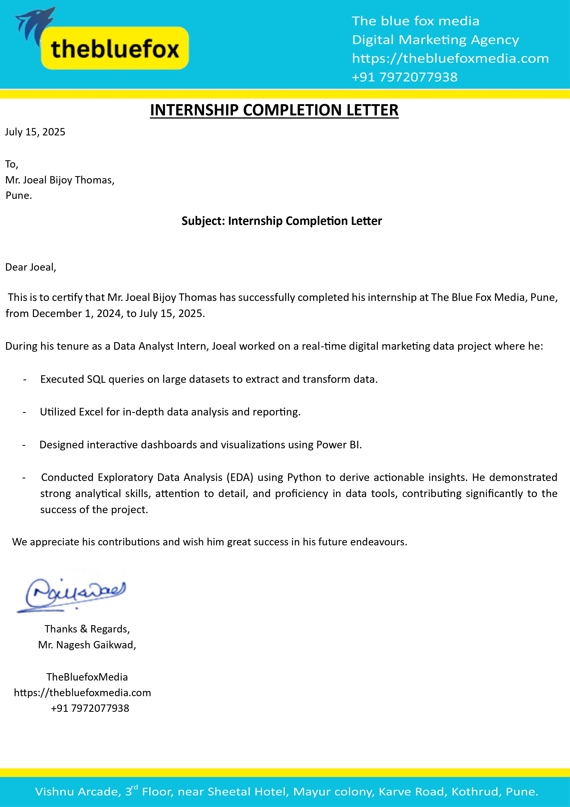

# 🌐 Joeal Bijoy Thomas — Personal Portfolio

> A fully responsive personal portfolio website built with HTML & CSS — showcasing my experience, education, projects, and skills as an aspiring Data Scientist.

---

## 🔗 Live Demo

👉 **[https://joealthomas4.github.io](https://joealthomas4.github.io)**

---

## 📸 Preview

---

## 📁 Project Structure
joealthomas4.github.io/
│
├── index.html # Main portfolio page
├── Joeal_Thomas_Resume_DS.pdf # Downloadable resume
└── images/
├── profile_pic.jpeg # Profile photo
├── bluefox.jpg # BlueFox project image
└── dentsu.jpg # Dentsu experience image

---

## ✨ Features

- ⚡ **Single-page layout** with smooth scrolling navigation
- 📱 **Fully responsive** — mobile, tablet & desktop friendly
- 🎨 **Modern UI** with gradient accents and card-based sections
- 📄 **Resume** — viewable and downloadable directly from the site
- 📬 **Contact form** for direct outreach
- 🧠 **Sections:** Hero · About · Experience · Education · Projects · Contact

---

## 🛠️ Built With

| Technology | Purpose |
|------------|---------|
| HTML5 | Page structure & content |
| CSS3 | Styling, animations & layout |
| CSS Grid & Flexbox | Responsive layout system |
| GitHub Pages | Free static site hosting |

---

## 🚀 Sections Overview

| Section | Description |
|---------|-------------|
| **Hero** | Introduction, profile photo, resume buttons |
| **About** | Background, skills & tech stack |
| **Experience** | Dentsu & BlueFox internship details |
| **Education** | University of Delaware — MS in Data Science |
| **Projects** | Data science & ML project showcases |
| **Contact** | Contact form + social links |

---

## 📬 Contact

| Platform | Link |
|----------|------|
| 💼 LinkedIn | [Joeal Bijoy Thomas](https://linkedin.com/in/joeal-bijoy-thomas) |
| 🐙 GitHub | [@joealthomas4](https://github.com/joealthomas4) |
| 🌐 Portfolio | [joealthomas4.github.io](https://joealthomas4.github.io) |

---

## 📄 License

This project is open source and available under the [MIT License](LICENSE).

---

⭐ *If you found this helpful, feel free to star the repo!*
